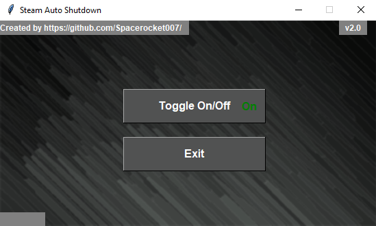

# Steam-Auto-Shutdown

This is a very simple and lightweight program to shutdown your computer after steam downloads finish. 
Unlike any other program, this one detects downloading files instead of checking for internet connection. 
Works both on Windows 10 and Linux (Ubuntu 21.04 tested)

------

# Included:
- github/ISSUE_TEMPLATE
- LICENSE
- README.md
- Steam-Auto-Shutdown
    - Steam-Auto-Shutdown-Linux.py <-- For Linux users, only run this
    - Steam-Auto-Shutdown.pyw <-- For Windows users, only run this

-----

# Features:

- Shutdown after downloads finish

- Cancel shutdown after it has been initiated.

- Select able steam download (downloading) folder (This is needed to show the program where games are downloaded and once they are grabbed, to turn off your Computer.)

- Toggle On/Off 

- Exit button

- Refresh indicator

-----

# How to install for Windows 10:

Requirements: Python 3.0 or newer (tested on Python 3.9)

 
Step 1: Download zip and extract all

Step 2: Open the folder Steam-Auto-Shutdown-main 

Step 3: Open the folder Steam-Auto-Shutdown and run Steam-Auto-Shutdown.pyw with Python.

-----

# How to install for Linux (Ubuntu 21.04):

Requirements: 
- Python 3.0 or newer (tested on Python 3.9)
- python3-tk (to install simply type in Terminal: sudo apt-get install python3-tk)

Step 1: Download zip 

Step 2: Extract all and move it to any location (in a way that you can easily find it again)

Step 3: Run Terminal and navigate to Steam-Auto-Shutdown-Linux.py with cd -> for example: cd /home/name/Documents/Steam-Auto-Shutdown-main/Steam-Auto-Shutdown/

Step 4: Paste this line to give the file read and write permissions: chmod +x Steam-Auto-Shutdown-Linux.py

Step 5: Run file with: python3 Steam-Auto-Shutdown-Linux.py

---------

# How to use:

Step 1: Start steam download

Step 2: Start Steam-Auto-Shutdown (If you are on Linux start Steam-Auto-Shutdown-Linux.py ; If you are on Windows start Steam-Auto-Shutdown.pyw)

Step 3: Press 'select in your steam folder 'downloading'' button (the folder which contains: common, downloading, temp etc. and select the folder 'downloading').

Note:

- Make sure to put everything (games/workshop/etc) to queue! Or else it won't work.

- Workshop updates or anything which has to do with Workshop won't be recognized as download.

- If download(s) finish(es), your computer will shutdown after 60 seconds.

Step 4: Thats it! :D

-----------
# Updates:

- July 16th, 2021 added Linux version
- July 17th, 2021 changed design
- July 17th, 2021 refer to release v2.0
- July 18th, 2021 added background

---------
Any ideas how to make it better? Want to give feedback? Have problems? Want to suggest features? Have a question?

Feel free to let me now!
